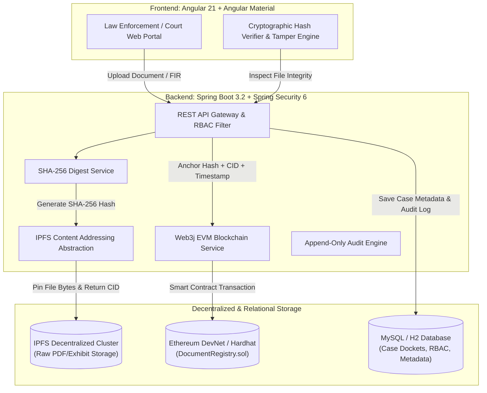

# ⚖️ Decentralized Legal Document & Court Evidence Vault (eVault)

> **Smart India Hackathon (SIH) Showcase Prototype**  
> *An Enterprise-Grade, Cryptographically Anchored Evidence & Legal Docket Repository utilizing IPFS, Ethereum Smart Contracts, Spring Boot 3, and Angular 21.*

---

## 🏛️ Executive Summary & Problem Statement

In the modern judicial and law enforcement ecosystem, legal documents (FIRs, charge sheets, witness testimonies, forensic laboratory findings, court orders) are vulnerable to unauthorized alteration, loss, and chain-of-custody disputes. 

**eVault** solves this fundamental trust deficit by introducing a **three-tier hybrid architecture**:
1. **Decentralized Storage (IPFS)**: Legal files are never stored directly on high-cost blockchain state; instead, files are pinned to IPFS and addressed by their deterministic Content Identifiers (`CIDv0/v1`).
2. **Cryptographic Proof Anchoring (Ethereum EVM Smart Contracts)**: A lightweight, tamper-proof Solidity smart contract (`DocumentRegistry.sol`) anchors the `SHA-256` document fingerprint, `IPFS CID`, timestamp, and registrar public key.
3. **Relational Metadata & Audit Ledger (Spring Boot + MySQL/H2)**: Manages case hierarchies, party details, role-based access control, search indexing, and append-only audit trail logs.

> ⚠️ **Judicial PoC Notice**: This system is built as a production-grade Proof of Concept (PoC) for the Smart India Hackathon (SIH). It is designed to demonstrate Section 65B Indian Evidence Act / BNSS technical alignment, but is not an officially deployed statutory judiciary system.

---

## 📐 System Architecture



---

## 👥 Role-Based Access Control (RBAC) & Pre-Seeded Demo Accounts

Every demo account is pre-configured and seeded into the vault. **Password for all accounts is: `Password@123`**

| Role | Demo Email | Primary Judicial / Investigative Capabilities |
| :--- | :--- | :--- |
| **`SUPER_ADMIN`** | `admin@evault.demo` | Full system governance, audit trail inspection, user provisioning, network configuration. |
| **`INVESTIGATING_OFFICER`** | `officer@evault.demo` | Register criminal dockets, upload FIRs, seize evidence items, record initial custody transfers. |
| **`PROSECUTOR`** | `prosecutor@evault.demo` | Review case exhibits, attach supplementary forensic affidavits, generate 48h discovery share links. |
| **`JUDGE`** | `judge@evault.demo` | Adjudicate dockets, verify cryptographic anchors in court, issue digitally anchored court orders. |
| **`LAWYER`** | `lawyer@evault.demo` | Access authorized discovery dockets, verify client charge sheets, review chain-of-custody milestones. |
| **`COURT_STAFF`** | `courtstaff@evault.demo` | Manage court docket schedules, update courtroom jurisdiction, record judicial minutes. |
| **`VIEWER`** | `viewer@evault.demo` | Read-only access to unsealed public case records and independent document verification engine. |

---

## 🚀 Quick Start Guide (Windows / Linux / macOS)

### Prerequisites
- **JDK 17, 21, or 25** (`java -version`)
- **Node.js 18+ & npm** (`node -v`)

### ⚡ 1-Click Startup (Windows)
Double-click `start-dev.bat` or run:
```powershell
.\start-dev.ps1
```
This automatically launches both the Spring Boot Backend (Port 8080) and the Angular Frontend (Port 4200).

---

### 🛠️ Manual Step-by-Step Startup

#### 1. Backend (Spring Boot 3.2.5)
```bash
cd evault-backend
.\mvnw.cmd spring-boot:run
```
- **REST API Port**: `http://localhost:8080`
- **Swagger OpenAPI Docs**: `http://localhost:8080/swagger-ui.html`
- **H2 Web Console**: `http://localhost:8080/h2-console` (`jdbc:h2:file:./data/evaultdb`, user: `sa`, password: empty)

#### 2. Frontend (Angular 21)
```bash
cd evault-frontend
npm start
```
- **Application Portal**: `http://localhost:4200`

#### 3. Smart Contracts (Hardhat / Solidity)
```bash
cd evault-blockchain
npx hardhat test
```
All 5 smart contract unit tests will execute and pass against the local EVM runtime.

---

## 🎯 5-Minute SIH Jury Presentation Script

Follow these steps for an impressive presentation before the hackathon judges:

### Step 1: Portal Overview & National Judicial Emblem
1. Open `http://localhost:4200`.
2. Highlight the government-grade theme (Deep Navy `#0A192F`, Slate, and Judicial Gold `#D97706`).
3. Explain the architecture card showing the separation between **IPFS storage** and **Ethereum EVM proof-of-existence anchoring**.

### Step 2: 1-Click Role Login
1. Click **"Sign In to Judicial Portal"**.
2. Click the quick-fill button **"Presiding Judge (Bench)"** (`judge@evault.demo` / `Password@123`).
3. Point out the dashboard metrics: Active Cases, Anchored Documents, Tamper Alerts, Storage Statistics, and Case Progression.

### Step 3: Case Docket Deep-Dive
1. Navigate to **Case Management** (`/cases`) and click on `CASE-2026-0001` (*State of Maharashtra vs. Arvind Sharma & Ors*).
2. Showcase the **Tabs**:
   - **Overview**: FIR details, IO, Public Prosecutor, and Presiding Judge.
   - **Documents**: Lists `FIR_001.pdf`, `Forensic_Report_001.pdf`, and `Court_Order_001.pdf` with their SHA-256 hashes and IPFS CIDs.
   - **Evidence**: Physical seized exhibit (*Samsung Galaxy S21 Ultra*, Item `#EV-2026-0001-A`).
   - **Chain of Custody**: Vertical timeline tracing evidence from crime scene seizure to laboratory analysis to courtroom presentation.
   - **Blockchain Proof**: Live on-chain table showing contract address `0x5FbDB...`, transaction hashes, and block numbers.

### Step 4: The Showstopper: Live Tamper Detection Demo
1. Navigate to **Verify Document** (`/verification`).
2. Show the **SIH Hackathon Live Test Bench**:
   - **Test 1 (Authentic)**: Click **"Test Authentic Docket (Match)"**. The verifier calculates the SHA-256 digest, checks the smart contract, and renders the **Glowing Green Shield: `✓ DOCUMENT VERIFIED (100% BITWISE PARITY MATCH)`**.
   - **Test 2 (Tampered)**: Click **"Test Altered Document (Tamper Alert)"**. An altered file with just 1 injected sentence is inspected. The engine immediately flashes the **Red Alert: `✕ CRITICAL: INTEGRITY TAMPER DETECTED!`** with side-by-side hash comparison and automatically logs a critical security incident in the audit ledger.

### Step 5: Immutable Audit Ledger
1. Navigate to **Audit Trail** (`/audit`).
2. Show the jury that the tamper attempt was immutably recorded with actor identity, timestamp, IP address, and security classification.

---

## 🔐 Section 65B Indian Evidence Act / BNSS Technical Compliance

Under Section 65B of the Indian Evidence Act, 1872 (and corresponding provisions in the Bharatiya Sakshya Adhiniyam, 2023), electronic records are admissible only when integrity, unbroken chain of custody, and unhampered computer systems can be demonstrated.

eVault satisfies these criteria through:
1. **Cryptographic Hash Anchoring**: SHA-256 digests mathematically guarantee that not a single bit has been altered since notarization.
2. **Decentralized Content Addressing**: IPFS prevents single-point-of-failure deletions or server-side silent replacements.
3. **Immutable Custody Log**: Every actor handover is recorded with cryptographic timestamps, preventing disputed possession.

---

## 📂 Project Directory Structure

```
evault-platform/
├── evault-backend/                 # Spring Boot 3.2 REST API
│   ├── src/main/java/com/evault/
│   │   ├── audit/                  # Append-only audit trail
│   │   ├── auth/                   # Spring Security 6 & JWT
│   │   ├── blockchain/             # Web3j & Ethereum anchoring
│   │   ├── cases/                  # Case docket management
│   │   ├── document/               # Document repository & SHA-256
│   │   ├── evidence/               # Physical evidence & chain of custody
│   │   ├── ipfs/                   # IPFS storage abstraction & Kubo client
│   │   ├── share/                  # Time-limited secure sharing
│   │   └── verification/           # Hash verification & tamper detection
│   └── pom.xml
├── evault-blockchain/              # Solidity Smart Contracts & Hardhat
│   ├── contracts/
│   │   └── DocumentRegistry.sol    # Proof-of-existence registry
│   ├── test/                       # 5/5 passing unit tests
│   └── hardhat.config.ts
├── evault-frontend/                # Angular 21 Enterprise UI
│   ├── src/app/
│   │   ├── core/                   # Services, guards, interceptors, models
│   │   ├── features/               # Landing, Auth, Dashboard, Cases, Docs,
│   │   │                           # Evidence, Verification, Audit
│   │   └── shared/                 # Navbar, Sidebar, UI tokens
│   └── angular.json
├── start-dev.bat                   # 1-Click Windows launcher
├── start-dev.ps1                   # 1-Click PowerShell launcher
└── README.md                       # Complete technical & demo guide
```

---

## 🏆 Hackathon Credits & Authors
Developed for **Smart India Hackathon (SIH)**. Engineered with modern security, decentralized consensus, and clean architectural design patterns.
"# evault-platform" 
